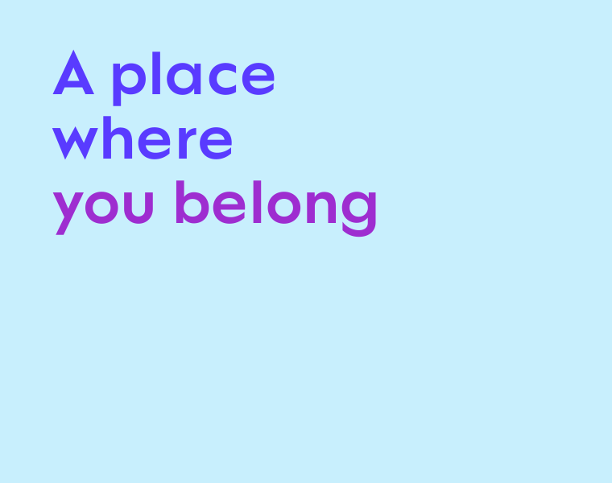
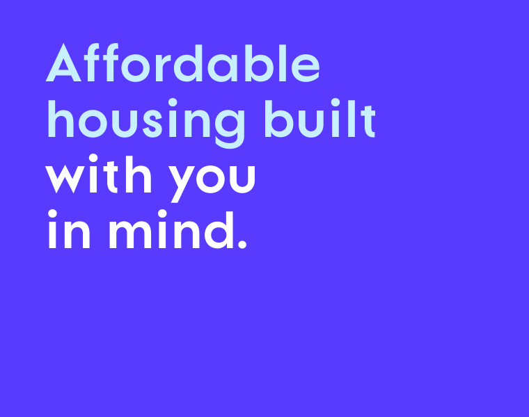
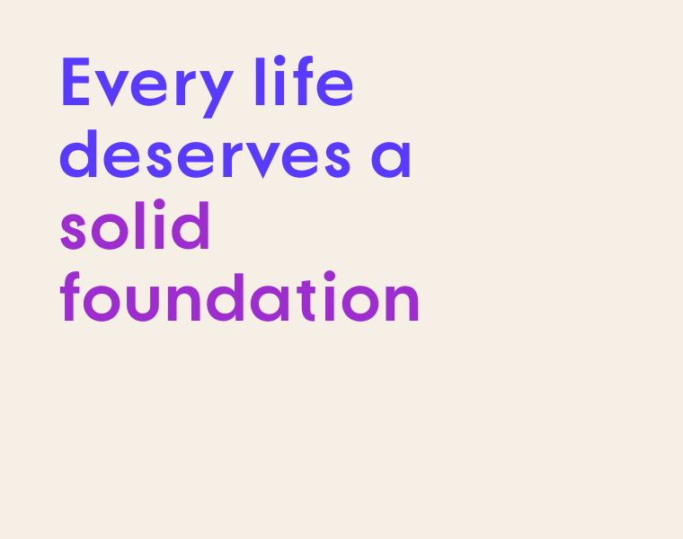

<picture>
  <source media="(prefers-color-scheme: dark)" srcset="./assets/chl-logo-tagline-white.png">
  <source media="(prefers-color-scheme: light)" srcset="./assets/chl-logo-tagline-colour.png">
  
</picture>

 

 

# Community Housing Limited on GitHub

*A world without housing poverty. Every life deserves a solid foundation.*

## About

Community Housing Limited (CHL) is an Australian not-for-profit community housing provider with national reach. CHL delivers safe, secure and affordable places for people to call home and belong, because every life deserves a solid foundation.

     

  

## Why we're on GitHub

- Engineering and automation for CHL's technology platforms.
- Collaboration with delivery partners.
- Tooling that CHL may share openly.

GitHub is not a customer service, tenancy, repairs or general enquiry channel. Please use CHL's [contact page](https://chl.org.au/contact/).

## Brand assets

The logos on this page are trademarks of Community Housing Limited and are protected by copyright. All rights reserved. They are not licensed for reuse. Applications of the CHL brand are governed by CHL Communications and Marketing.

 

---

 

<picture>
  <source media="(prefers-color-scheme: dark)" srcset="./assets/chl-wordmark-tagline-white.png">
  <source media="(prefers-color-scheme: light)" srcset="./assets/chl-wordmark-tagline-colour.png">
  
</picture>

[chl.org.au](https://chl.org.au/)

