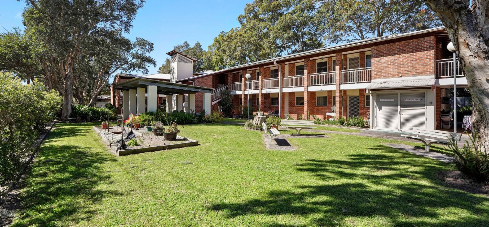
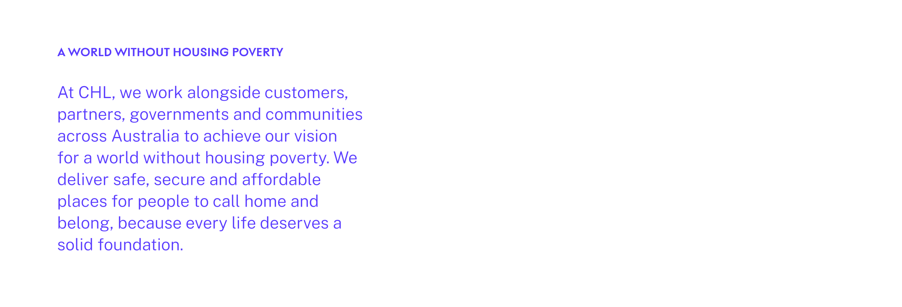
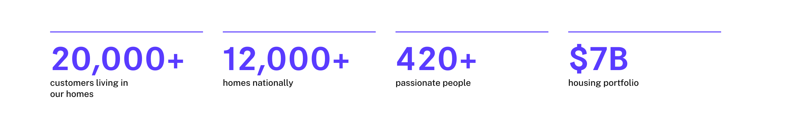
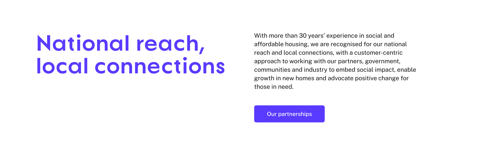
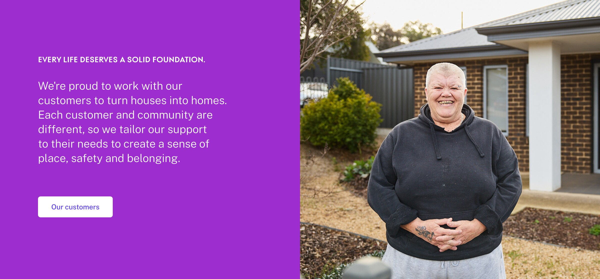
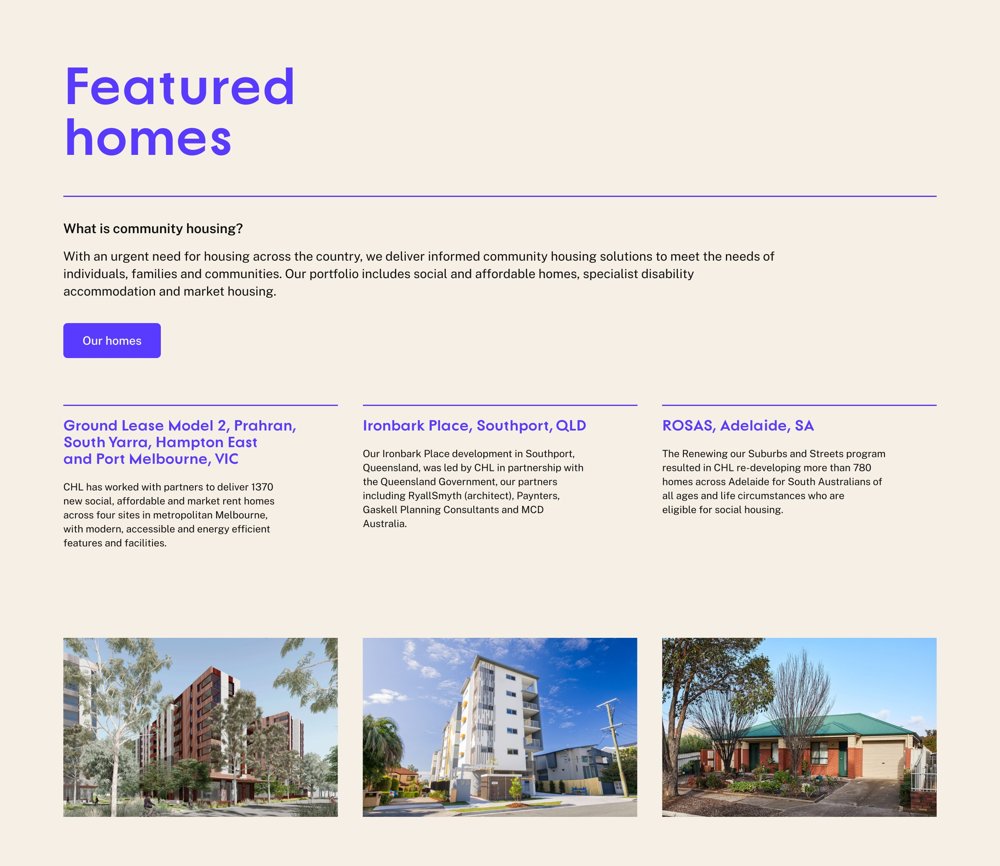
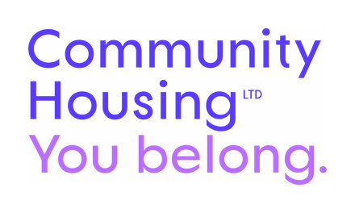

<picture>
  <source media="(prefers-color-scheme: dark)" srcset="./assets/chl-logo-tagline-white.png">
  <source media="(prefers-color-scheme: light)" srcset="./assets/chl-logo-tagline-colour.png">
  
</picture>

 

 

<picture>
  <source media="(prefers-color-scheme: dark)" srcset="./assets/chl-wordmark-tagline-white.png">
  <source media="(prefers-color-scheme: light)" srcset="./assets/chl-wordmark-tagline-colour.png">
  
</picture>

 

[chl.org.au](https://chl.org.au/)

The CHL logos and brand assets on this page are trademarks of Community Housing Limited, all rights reserved, and are not licensed for reuse. Applications of the CHL brand are governed by CHL Communications and Marketing.

